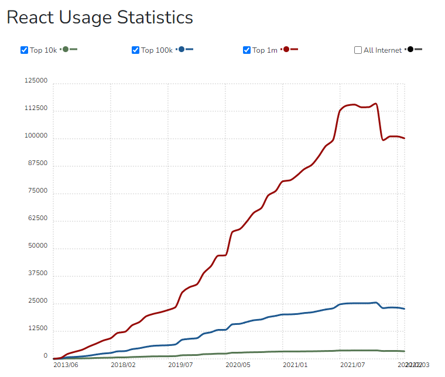
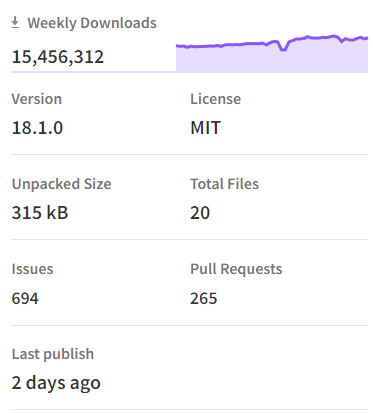
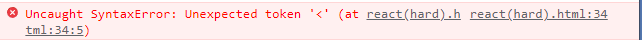
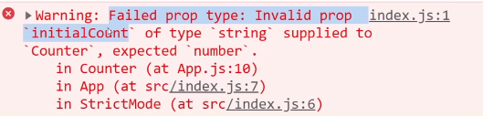
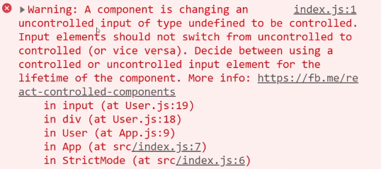
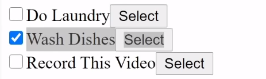
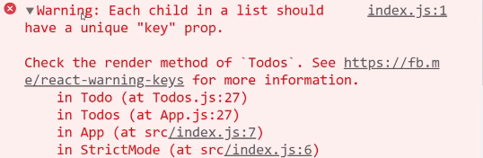
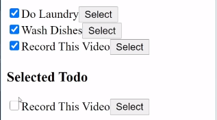
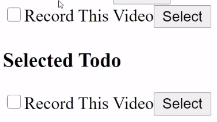

# React

## Why React?

어떤 것을 배운다는 것은 투자한다는 것. 따라서 배움에 투자하는 시간 대비 얼마나 큰 효과와 결과를 만들어내냐가 중요하다.

1. **react를 사용하는 많은 회사**

   신기술을 배울때 중요한 것은 누가 이 기술을 사용하는지, 그들의 규모가 얼마나 큰지 꼭 살펴봐야 한다.

   

   

   상위 1m 사이트들 중 react가 차지하는 양(출처: [buildwith](https://trends.builtwith.com/javascript/React))

   또한 그것을 사용하는 회사에게 그것이 얼마나 중요한지 생각해 보아야 한다. 에어비앤비, 인스타그램, 넷플릭스.. 이들에게 React.js는 얼마나 중요한가. 즉 이들 회사에게 웹사이트의 중요성은 어느정인가? very important

2. **react는 어디서 왔는가?**

   페이스북이 만들었고, 오늘날에도 React.js로 작업하고 개발진들을 지속적으로 채용하면서 더 발전시키고있다. 이들이 React.js를 금방 폐기할 순 없을 것

3.  **커뮤니티**

   React를 사용하는 것은 JavaScript를 사용하는 것과 매우 유사하기 때문에 많은 JavaScript 사용자들이 React를 사용한다. 자연스럽게 규모가 커지게 됨.

   커뮤니티가 거대하다는 것은 library, guide, package, teacher, 직업, 채용 등의 규모또한 거대하다는 것.

   

   주간 설치횟수가 천만이 넘어가는 react(출처 : [npmjs](https://www.npmjs.com/package/react))

## Requirement

HTML, CSS, JS 이해도 필요.

**설치**

1. HTML에서 바로 사용하기

   React를 설치하기 위해서는 두 개의 JavaScript 코드를 import해야한다. `react`와 `react-dom`이다.

   ```html
   <!DOCTYPE html>
   <html>
       <body></body>
       <script src="https://unpkg.com/react@17/umd/react.development.js"></script>
       <script src="https://unpkg.com/react-dom@17/umd/react-dom.development.js"></script>
   </html>
   ```

   

## Basic of React

React는 UI를 interactive하게 해준다. 웹사이트에 interactivity(상호작용)을 만들어주는 것.

React.js Element 생성하기(어려운 방법)

```html
<!DOCTYPE html>
<html>
    <body>
    	<div id="root"></div>
    </body>
    <script src="https://unpkg.com/react@17/umd/react.d..."></script>
    <script src="https://unpkg.com/react-dom@..."></script>
    <script>
        const root = document.getElementById("root");
    	const span = React.createElement("span");
        ReactDom.render(span, root);
    </script>
</html>
```

reactjs : interactive한 react element 생성

reactDOM : react element를 HTML로 변경

- JSX

  `createElement`는 개발자들이 interactive한 요소를 보다 간편하게 만들기위해서 생겨났는데 이를 react에서 활용한 것이 바로 JSX.

  HTML에서 활용하는 문법과 유사하게 코드를 작성하여 요소를 생성할 수 있다.

  위의 경우와 아래의 경우는 같은코드

  ```react
  const title = React.createElement("h3", {onMouseEnter: () => console.log("I'm clicked!")}, "title");
  
  const Title = (
  	<h3 onMouseEnter={() => console.log("I'm clicked!")}>
      	title
      </h3>
  )
  ```

  바로 JSX를 사용할 경우 에러가 발생한다.

  

  따라서, 아래의 코드를 위의 코드로 변환시켜야 함. 브라우저가 JSX를 이해할 수 있도록 뭔가를 설치해줘야만 한다. `Babel`

- `Babel` : 코드를 변환해주는 녀석

  JSX로 적은 코드를 브라우저가 이해할 수 있는 형태로 바꿔줌.(브라우저는 JSX를 모름)

  혼자 할 경우 babel standalone을 설치해주자.([BABEL링크](https://babeljs.io/docs/en/babel-standalone))

  ```react
  <script src="https://unpkg.com/@babel/standalone/babel.min.js"></script>
  <script type="text/babel">
  	...
  </script>
  ```

- 컴포넌트를 다른 컴포넌트안에 어떻게 넣는가.

  ```react
  function Title() {
      return (
      	<h3>...</h3>
      )
  }
  
  const Button = () => (
  	<button>...</button>
  )
  
  const Container = (
  	<div>
      	<Title />
          <Button />
      </div>
  )
  ```

- state

  vanilla.js의 경우 state가 변경되면 html이 재렌더링 되면서 UI가 업데이트 되는 반면에 React.js의 경우 새 컴포넌트를 생성하느 것이 아니라 이전에 렌더링된 html과 변경된 html을 **비교하여 변경된 부분만 다시 렌더링**을 해준다.

  ```react
  const root = document.getElementById("root");
  let counter = 0;
  function countUp() {
      counter = counter + 1;
      render();
  }
  function render() {
      ReactDOM.render(<App />, root)
  }
  const App = () => (
  	<h3>Total Clicks : 0</h3>
      <button onClick={countUp}>click me!</button>
  )
  render();
  ```

  react 어플 내에서 data를 저장하고, 자동으로 리렌더링을 일으킬 수 있는 방법.

- state 변경

  - setCounter를 사용해서 counter를 변경하는 방법(직접 값을 설정해주기)

    ```react
    setCounter(counter + 1);
    ```

  - 이전 값을 이용해서 현재 값을 계산하는 방법(함수를 전달하기)

    ```react
    setCounter((current) => current + 1);
    ```

    :alembic: 현재 state를 바탕으로 다음 state를 계산하고 싶다면 아래 방법으로 하는 것이 보다 안전하다.(counter가 setCounter 외적으로 변경될 가능성이 있기 때문) 이게 현재 state를 주고, 예상치 못한 업데이트가 어디선가 일어났다고 해도, 혼동을 주는걸 방지해준다.


---

## How to write better code - React

참고영상 : https://www.youtube.com/watch?v=0yzoAbrjV6k

> 220628 리액트를 사용하면서 하기 쉬운 실수, 주의해야되는 부분들에 대해서 정리

### State Mistakes

아래와 같이 `useState`를 사용하지않고 state를 변경할 경우 즉각적으로 화면에 반영되지 않는다.(재렌더링이 필요하기때문)

```react
function increaseCount() {
    count = count + 1; // 화면에 interative한 반영 x
}
```

- asyncronous

또한 `useState`는 비동기적(asynchronous)으로 처리되기 때문에 예를들어 아래와 같이 코드를 작성하면 `setCount`가 호출되고 state가 변경되기전에 바로 count가 콘솔에 찍히게 된다. 따라서 이에대한 비동기처리를 해주는 것이 필요하다.

```react
const [count, setCount] = useState(0);
function increaseCount() {
    setCount(count => count + 1);
    console.log(count) // 0
}
```

이럴때는 `useEffect`를 활용하자

```react
const [count, setCount] = useState(0);
function increaseCount() {
    setCount(count => count + 1);
}
useEffect(() => {
    console.log(count)
}, [count])
```

`useEffect`는 2번째 인자인 배열내에 존재하는 dependencies(여기서는 `count`)의 변경을 감지하여 실행되는 훅이다. 배열내의 변화를 감지할때마다 실행되게 된다.

- `propTypes` 활용하기

number를 받아야하는데 string을 받는 경우를 대비하여 prop의 타입을 지정하여 원하는 타입의 prop만을 받을 수 있게하는 `propTypes`방법이 있다.

```react
Counter.propTypes = {
    initialCount: PropTypes.number
}
```

이처럼 prop 타입을 지정했는데 string 타입의 prop이 들어오게 된다면 아래와 같이 오류가 발생하게 된다. 



- current state사용하기

아래의 경우를 살펴보면 화면에 보이는 count는 1이 된다.

```react
const [count, setCount] = useState(0);
function increaseCount() {
    setCount(count + 1);
    setCount(count + 1);
}
```

그 이유는,  react count 변수를 얻지 못했기 때문이다. 따라서 아래와 같이 코드를 사용하면서 현재 real state를 사용할 수 있도록 하자

```react
const [count, setCount] = useState(0);
function increaseCount() {
    setCount(count => count + 1);
    setCount(count => count + 1);
}
```

이와같은 방식을 사용하면 `setCount`를 할때마다 previous state를 기반으로 수정이 가능하다.

### Effect Mistakes

essentially inside of here what we're focusing on is really how useEffect works and how we can purposely use useEffect in order to exactly what we want

- input value 설정 실수(control되지않는 컴포넌트)

```react
function User({ age }) => {
    const [name, setName] = useState()
    return (
    	<input value={name} onChange={e => setName(e.target.value)}/>
    )
}
```

이 경우에는 아래와 같은 에러가 뜨게된다.



default 값으로 undefined 혹은 null이 들어갈 경우에는 자체적으로 해당 input을 컨트롤 할 수 없는 컴포넌트로 인식하고 브라우저로 넘겨버리게 된다. 따라서 기본적으로 빈 문자열 표시(`""`)를 해주도록 하자.

- useEffect의 실행

```react
function User({age}) => {
    const [name, setName] = useState("");
    const [dark, setDark] = useState(false);
    const user = { age, name }
    const buttonStyle = {
        backgroundColor: dark ? "#000" : "initial",
        color: dark ? "#FFF" : "initial"
    }
    useEffect(() => {
        console.log(user)
    }, [user])
}
```

어떤 값이 변경될때마다 그 변화를 콘솔로 찍고 싶다면 `useEffect` 두 번째 인자로 들어가는 배열에 감지하고자하는 state를 추가해주자.

그런데 지금은 user가 변하지 않았는데도 계속해서 콘솔에 찍히는데 그 이유는 컴포넌트가 매번 렌더링 될때마다 안의 내용은 같지만 다른 user 객체가 생성되기 때문에 useEffect가 실행된다.

이럴경우에는 user 자체가 아니라 user 객체 내부의 value를 사용할 수 가 있다.

```react
function User({age}) => {
    const [name, setName] = useState("");
    const [dark, setDark] = useState(false);
    const user = { age, name, birthday, favorite, id ... }
    const buttonStyle = {
        backgroundColor: dark ? "#000" : "initial",
        color: dark ? "#FFF" : "initial"
    }
    useEffect(() => {
        console.log(user)
    }, [age, name, birthday, favorite ...])
}
```

이 경우 제대로 작동하지만 객체 내부의 value가 많아지면 그에 비례하게 useEffect에서 감지하는 state의 수가 증가하게 된다. 이 경우 다음과 같이 `useMemo`를 사용할 수 있다.

```react
function User({age}) {
    const [name, setName] = useState("");
    const [dark, setDark] = useState(false);
    
    const user = useMemo(() => {
        return { age, name }
    }, [name, age]) // array 내부에 dependencies들이 존재
    
    useEffect(() => {
        console.log(user)
    }, [user])
    
    return (
        <>
    		<button onClick={() => setDark(true)}></button>
        	<input onChange={e => {
                setName(e.target)
            }}/>
        	<Game user={user} />
		</>
    )
}

export default React.memo(User); // React dev tool 현재 렌더링되는 컴포넌트를 하이라이트. 
```

`useMemo`의 경우 array내부의 dependecies들이 변경되면 첫번째 인자에 들어가는 함수를 실행시키면서 새로운 값을 세팅하게된다.

name, age가 바뀌지 않으면 `useMemo`는 항상 같은 user 객체를 반환하게 된다. 따라서 컴포넌트가 렌더링 될때마다 새로운 객체를 생성하지 않는다는 것.

### List Mistakes

아래와 같은 리스트를 사용한 todolist를 만들어보겠습니다.

```react
export default function App() {
    const initialTodos = [
        {
            id: 1,
            complete: false,
            name: "Do Laundry"
        },
        {
            id: 2,
            complete: true,
            name: "Wash Dishes"
        },
        {
            id: 3,
            complete: false,
            name: "Learn React"
        },
    ]
    return(
    	<>
        	<Todos initialTodos={initialTodos} />
        </>
    )
}
```

Todos를 살펴보면

```react
function Todos ({ initialTodos }) {
    const [todos, setTodos] = useState(initialTodos);
    const [selectedTodo, setSelectedTodo] = useState();
    
    function handleToggleComplete(todoId) {
        setTodos(currTodos => {
            // find() 메서드는 주어진 판별 함수를 만족하는 첫 번째 요소의 값을 반환한다. 요소가 없다면 undefined를 반환.
            const todo = currTodos.find(todo => todo.id === todoId)
            todo.complete = !todo.complete
            return currTodos
        })
    }
    
    function handleSelect(todoId) {
        setSelectedTodo(todos.find(todo => todo.id === todoId))
    }
    
    return (
    	<>
        	{todos.map(todo => (
             	<Todo 
                	todo={todo}
                    handleToggleComplete={handleToggleComplete}
                    handleSelect={handleSelect}
                />
             ))}
			<h3>Selected Todo</h3>
			{selectedTodo && (
            	<Todo 
                	todo={selectedTodo}
                    handleToggleComplete={handleToggleComplete}
                    handleSelect={handleSelect}
                />
            )}
        </>
    )
}
```

Todo를 살펴보면

```react
function Todo({ todo, handleToggleComplete, handleSelect }) {
    function toggleComplete() {
        handleToggleComplete(todo.id)
    }
    function onSelect() {
        handleSelect(todo.id)
    }
    return (
    	<div>
        	<input 
            	type="checkbox"
                checked={todo.complete}
                onChange={toggleComplete}
            />
            {todo.name}
            <button onClick={onSelect}>Select</button>
        </div>
    )
}
```

여기서 문제는 아래의 체크박스를 클릭해도 바로 화면에 적용되지를 않는다. 



`handleToggleComplete` 함수가 실행될 때 기존의 currTodos의 데이터를 직접 수정하기 때문에 문제가 발생한다. React에서는 state를 직접 변경하는 것이 아니라 새로운 array를 반환하는 것이 올바른 방식이다. 새로 생성되는 array가 update된 state를 갖도록 만들어주자.

```react
// Todos
function handleToggleComplete(todoId) {
    setTodos(currTodos => {
        return currTodos.map(todo => {
            if (todo.id === todoId) {
                return { ...todo, complete: !todo.complete }
            }
            return todo
        })
    })
}
```

`map`함수는 array 요소를 순회하면서 currentArray의 어느것도 수정하지 않고 **새로운 array를 반환**

또한 각 Array.map을 통해서 생성되는 컴포넌트들은 key값을 갖고 있어야만 한다. 아니면 아래와 같은 오류가 발생함.



따라서 각 컴포넌트에 id를 추가해주도록한다. React에서 key prop을 사용하여 객체가 변경되면 해당 key값을 가지고 업데이트가 필요한 array의 요소만 업데이트가 가능하다.

```react
{todos.map(todo => (
	<Todo 
    	key={todo.id}
        todo={todo}
        ...
    />
))}
```

다만 이제 아래와 같은 문제가 발생한다. 하단의 selected Todo와 상단의 todo는 같은 내용을 담지만 체크박스가 동일하게 작동하지않는다는 점.



동일하게 작동하도록 작성해보면 아래와 같다.

```react
function Todos({ initialTodos }) {
    const [todos, setTodos] = useState(initialTodos);
    const [selectedTodoId, setselectedTodoId] = useState();
    const selectedTodo = todos.find(todo => todo.id === selectedTodoId)
}
```

이제 상단과 하단의 todo는 같은 객체를 참조하고 있다는 것을 확인할 수 있다.



